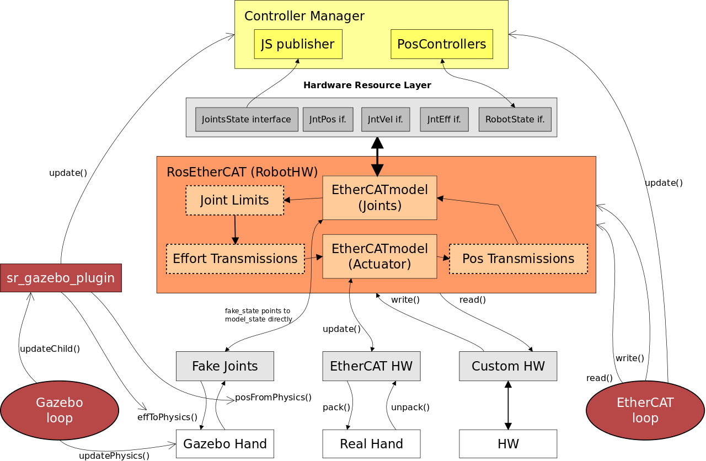

ros_ethercat
------------
## CI Statuses

Check | Status
---|---
Build|
Style|
Code Coverage|

## Overview

  This is a reimplementation of the main loop of pr2_ethercat without dependencies on PR2 software. It was mainly developed to be used by Shadow Robot Company. It may be useful to anyone people that has developed ROS software for their own robot and used etherCAT for communication. Most likely such software would be based on the software for Willow Garage's PR2. ros_ethercat reuses existing etherCAT drivers (eml package) and instantiates a ros_control controller manager. Part of the software in this repository comes from repositories pr2_mechanism, pr2_robot, pr2_ethercat_drivers. The parts specific to the pr2 robot only have been removed. Therefore, the same license (BSD) has been used.

*pr2 packages no longer required*

  1. ethercat_hardware
  2. pr2_bringup
  3. pr2_ethercat
  4. pr2_mechanism
  5. pr2_controller_interface
  6. pr2_controller_manager
  7. pr2_hardware_interface
  8. pr2_mechanism_diagnostics
  9. pr2_mechanism_model

You can find the architecture diagram below for a closer look at how this works.

## Compatibility

In software with previous pr2 dependencies that is switched to this package, the following modifications are required.

### Controllers

 1. `#include <controller_interface/controller.h>` 
instead of `#include <pr2_controller_interface/controller.h>`
 2. `class MyController : public controller_interface::Controller<ros_ethercat_mechanism_model::RobotState>` 
instead of `class MyController : public pr2_controller_interface::Controller`
 3. Controller's update function should be declared as  `virtual void update(const ros::Time&, const ros::Duration&)`  and starting function as   `virtual void starting(const ros::Time& time)`,br.
 4. `controller_manager` and `controller_interface` should be used as dependencies in `CMakeLists.txt` and `package.xml` files instead of `pr2_controller_manager` and `pr2_controller_interface` respectively.
 5. In `package.xml` file in export tag use `<controller_interface plugin="${prefix}/controller_plugins.xml"/>`
 6. In `controller_plugins.xml` file use `base_class_type="controller_interface::ControllerBase" />`

### launch files

 1. Replace `pr2_ethercat` with `ros_ethercat_loop` in launch files
 2. Since pr2_controller_manager is no longer used, joint_states or mechanism_statistics are no longer published by it. Joint states are now  published with the join_state_controller from ros_controllers. To start this controller this line need to be added in the main launch file   `<include file="$(find ros_ethercat_model)/launch/joint_state_publisher.launch"/>`
 3. `calibrate.py` file from pr2_bringup is now included in ros_ethercat_model package and renamed to just `calibrate` according to ROS convention. Launch files that execute `calibrate.py` should be modified to find it there.

### transmissions

 Transmissions are still defined in urdf in the pr2 style and inherit from `ros_ethercat_model::Transmission`. This class will initialize the actuators associated with this transmission.

## New features
 1. ros_ethercat accepts a new argument `--period` which is the period of main ethercat loop in msec. If not given the default value is 1ms.
 2. There is a helper bash script called ethercat_grant. This will grant to the ros_ethercat_loop executable the ability to be ran from a normal user without root privileges. E.g. of use `rosrun ros_ethercat_loop ethercat_grant`
